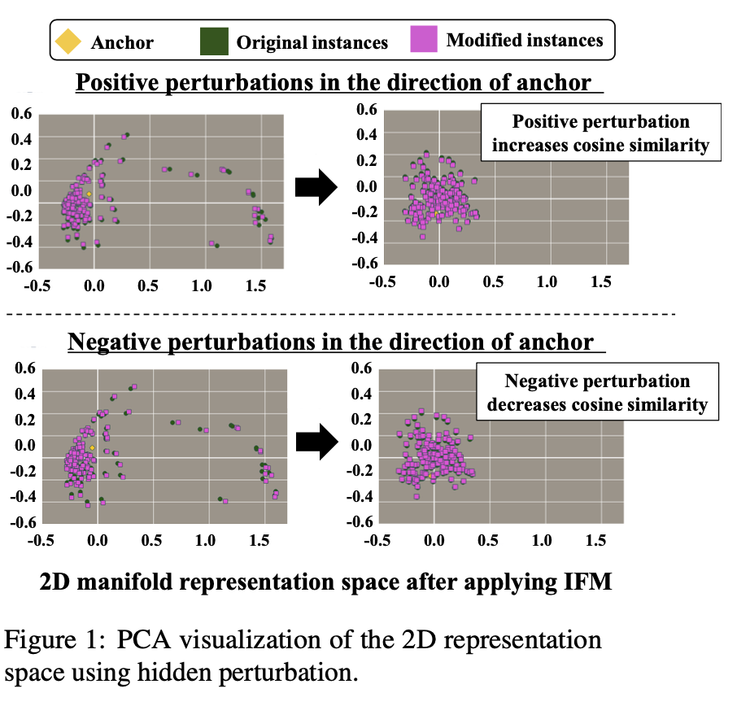

# Bootstrap Your Own PLM: Boosting Semantic Features of PLMs for Unsuperivsed Contrastive Learning
----
This repo contains implementation of [Bootstrap Your Own PLM: Boosting Semantic Features of PLMs for Unsuperivsed Contrastive Learning](). Our code is mainly based on the code of [SimCSE](https://arxiv.org/abs/2104.08821). Please refer to their [repository](https://github.com/princeton-nlp/SimCSE) for more detailed information.

[](https://opensource.org/licenses/MIT)

# Overview

This paper aims to investigate the possibility of exploiting original semantic features of PLMs (pre-trained language models) during contrastive learning in the context of SRL (sentence representation learning). We propose BYOP, which boosts well-represented features, taking the opposite idea of IFM, under the assumption that SimCSE’s dropout-noise-based augmentation may be too simple to modify high-level semantic features, and that the features learned by PLMs are semantically meaningful and should be boosted, rather than removed. 

<p align="center">


## Setups

[](https://www.python.org/downloads/release/python-386/)
[](https://pytorch.org/get-started/previous-versions/)

### Requirements

First, install PyTorch by following the instructions from [the official website](https://pytorch.org). 

```bash
pip install torch==1.12.1+cu116 --extra-index-url https://download.pytorch.org/whl/cu116
```

If you instead use **CUDA** `<11` or **CPU**, install PyTorch by the following command,

```bash
pip install torch==1.12.1
```

Then run the following script to install the remaining dependencies,

```bash
pip install -r requirements.txt
```

### Download the pretraining dataset
```
cd data
bash download_wiki.sh
```

### Download the downstream dataset
```
cd Eval/data/
bash download.sh
```

## Training
```bash
python train.py \
    --model_name_or_path bert-base-uncased \
    --train_file data/wiki1m_for_simcse.txt \
    --output_dir <output_model_dir> \
    --num_train_epochs 1 \
    --per_device_train_batch_size 64 \
    --learning_rate 3e-5 \
    --max_seq_length 32 \
    --evaluation_strategy steps \
    --metric_for_best_model stsb_spearman \
    --load_best_model_at_end \
    --eval_steps 250 \
    --pooler_type cls \
    --mlp_only_train \
    --overwrite_output_dir \
    --temp 0.05 \
    --do_ifm \
    --ifm_mode single \
    --ifm_type n- \
    --ifm_logit_type constant \
    --margin 0.01 \
    --do_train \
    --do_eval \
    --fp16 \
    "$@"
```

## Evaluation

You can run the commands below for evaluation after using the repo to train a model:

```bash
python evaluation.py \
    --model_name_or_path <output_model_dir> \
    --pooler cls_before_pooler \
    --task_set <sts|transfer|full> \
    --mode test
```

For more detailed information, please check [SimCSE's GitHub repo](https://github.com/princeton-nlp/SimCSE).

## Citation

Please cite our paper if you use Temperature Cooldown in your work:
